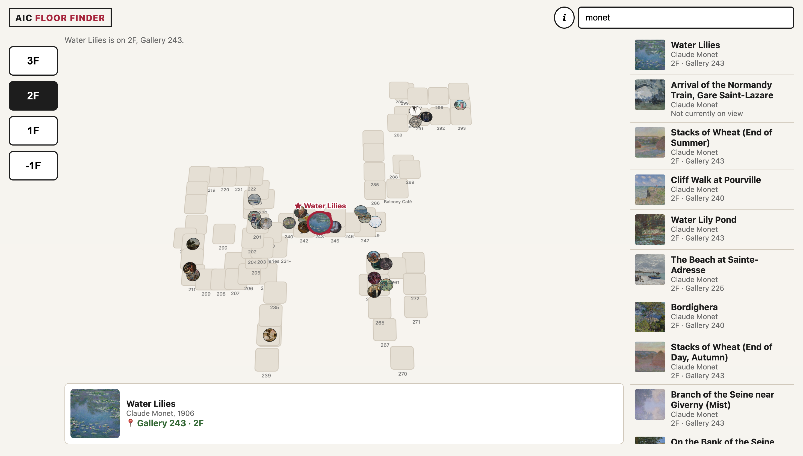

# Day 1 "before" snapshot

Write your own, even if you worked in a pair. Keep it: we come back to it at mid-quarter (Week 6) and at the end (Week 11). Your prompts go in `ai_log.md`, not here.

**Name:**
**Partner (if any):**

## Before we prompted

### 1. Who is it for, and what do they want to do?

It's for first-time audience who want to where an artwork is in the museum before their visit.

**"The user can..." sentences:**
1.search for an artwork or artist and see results with images.
2.click a floor to see that floor's plan and the artworks on it.

### 2. Our sketch

Put the photo in this `hw0` folder, then change the filename below to match:

### 3. Our prediction

We expected the app would be able to use the floor plan or Art Institute of Chicago to show the artworks in every floor.
And users can use a searchbar to explore the artworks in the institute.

## What we got

### 4. What the AI made

Put the screenshot in this `hw0` folder, then change the filename below to match:

### 5. Sketch vs. app

- **Matches our sketch:**
- A vertical floor index on the left: 3F, 2F, 1F, -1F.
- Clicking a search result jumps to the correct floor and highlights the room and the artwork.
- A floor plan in the center, drawn from `/api/v1/galleries` coordinates and not from a map image.

- **Different from our sketch:**
- The sketch shows the floor plan as a strongly slanted parallelogram. The app only tilts it slightly.
- Galleries are drawn as identical squares at their center points, not as real room shapes.

- **The AI decided** (something we never said):
- Layout for search results: a third column on the right for search results, plus a details card under the map. Our sketch didn't say where results go.
- Each floor shows the 30 most popular on-view works, a search returns 20 results, and the app opens on 1F.
- Clicking an artwork on the map also shows its details. If you click floors quickly, only the last floor you clicked is drawn.

### 6. What did I keep, change, or reject, and why?
- Kept the jump-to-floor and highlight behavior. This was our most important moment, and it worked when I tested it: clicking "Nighthawks" took me to 2F and highlighted Gallery 262.
- Rejected: nothing yet.

### 7. Explain back

Pick one part of the code. In your own words, what does it do?

I picked locate(), the function that runs when you click an artwork in the search results or on the map.

If the artwork is on view and its gallery is on the map, locate() calls showFloor() for that floor and tells it which artwork to highlight. showFloor() then redraws the floor plan, gives the room a red outline, and puts a pulsing ring around the artwork. If is_on_view is false, it doesn't move the map. It just shows "Not currently on view."

## Looking ahead

### 8. What does it do? Does it work? What broke?
- What it does: you search for artworks, pick a floor, see that floor's galleries and popular works, and click an artwork to jump to its floor and highlight it.
- What works: floor switching, search, jump-to-floor plus highlight, and "Not currently on view."
- What broke:
  - The floor plan is approximate. The API only gives one point per gallery, so rooms are equal squares, and some labels and thumbnails overlap.
  - A few galleries have no coordinates, so artworks in them can't be shown on the map.

### 9. How much do I understand about how it works? (0–100%)

**My number: 50**

**Why that number:**
- I can understand how code works. But when it comes to API calling, I know very little about how it really works.

### 10. What would I need to know to tell whether it's *well designed or well built*?
- Can they find an artwork and understand where it is quickly?
- Does it work in different browsers?
- Is the code easy for someone else to read and change?

### 11. What do I hope to be able to do by week 10?
- Read and change code like this on my own, without asking the AI for every step.
- Understand how APIs work well enough to write my own requests and filters.

